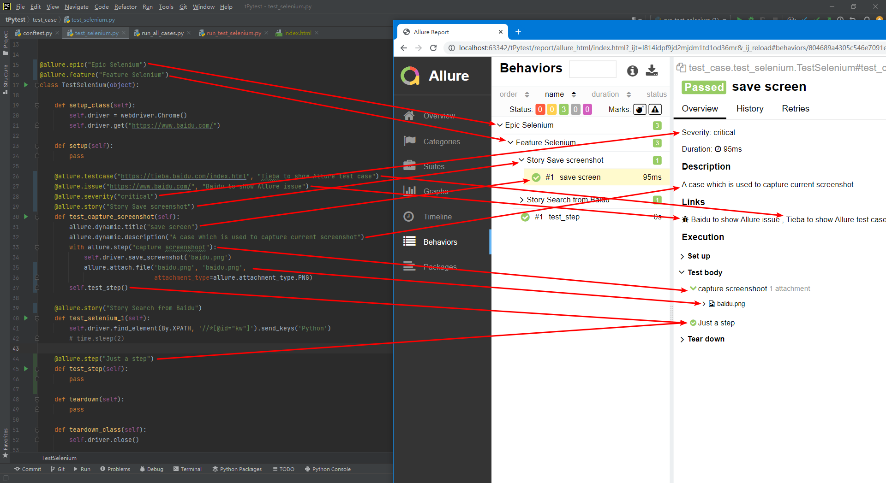

# Allure Features

Allure 目前支持几乎所有可用的功能，除了Pytest环境。

1. `@allure.epic('×××')`
   1. 史诗级分层
   2. 敏捷里面的概念，定义史诗，往下是 feature
2. `@allure.feature('×××')`
   1. #一级分层
   2. 功能点的描述，理解成模块往下是 story
3. `@allure.story('×××')`
   1. #二级分层
   2. 故事，往下是 title
4. `@allure.title("This test has a custom title")`
5. `@allure.step`
6. `Description`
   1. @allure.description
   2. @allure.description_html
   3. @allure.dynamic.description
   4. Alternatively description
7. `Links`
   1. @allure.link
      1. 提供指向所提供url的可单击链接
   2. @allure.issue 
      1. 提供一个带有小错误图标的链接
   3. @allure.testcase 
      1. 指向某个case的链接
8. `Attachment`
   1. allure.attach(body, name, attachment_type, extension):
   2. allure.attach.file(source, name, attachment_type, extension):





## 知识点
1. story 是 feature 的子集，当测试用例有 @allure.feature、@allure.story 时，在报告上会先显示 feature，点开之后再显示 story【可以想象成，安徒生童话（feature）有很多个童话故事（story）】
2. 如果不加 @allure.feature、@allure.story 时，在Behaviors栏目下，测试用例都不会分类显示，当用例多的时候可能看的花里胡哨
3. 倘若是用 pytest+allure 写项目，又想用 @pytest.mark.xxx 来给不同的用例添加标记的话，可以尝试用 @allure.feature、@allure.story 替换，毕竟可以显示在报告上


## 命令行指定运行

用命令行方式运行时，可以指定运行某个story、feature、epic吗？

当然可以，跟 @pytest.mark.xxx 指定标签运行的方式没啥区别，添加下面的命令行参数就行
```
--allure-epics
--allure-features
--allure-stories
``` 

举栗子
```sh
# 只运行 epic 名为 test 的测试用例
pytest --alluredir ./report/allure --allure-epics=test

# 只运行 feature 名为 模块 的测试用例
pytest --alluredir ./report/allure --allure-features=模块

# 只运行 story1、story2 的测试用例（也可以不用=号 空格就行了哦）
pytest tests.py --allure-stories story1,story2

# 指定 feature+story
pytest tests.py --allure-features feature2 --allure-stories story2
```


## 实例

```py
#!/usr/bin/env python
# -*- coding: utf-8 -*-

"""
__title__  =
__Time__   = 2020-04-19 14:27
__Author__ = 小菠萝测试笔记
__Blog__   = https://www.cnblogs.com/poloyy/
"""

import allure


def test_without_any_annotations_that_wont_be_executed():
    pass


@allure.story('epic_1')
def test_with_epic_1():
    pass


@allure.story('story_1')
def test_with_story_1():
    pass


@allure.story('story_2')
def test_with_story_2():
    pass


@allure.feature('feature_2')
@allure.story('story_2')
def test_with_story_2_and_feature_2():
    pass
```

```py
#!/usr/bin/env python
# -*- coding: utf-8 -*-

"""
__title__  = 
__Time__   = 2020/10/27 19:44
__Author__ = 小菠萝测试笔记
__Blog__   = https://www.cnblogs.com/poloyy/
"""
import os

import allure
import pytest


@pytest.fixture(scope="session")
def login_fixture():
    print("=== 前置登录 ===")


@allure.step("步骤1")
def step_1():
    print("操作步骤---------------1")


@allure.step("步骤2")
def step_2():
    print("操作步骤---------------2")


@allure.step("步骤3")
def step_3():
    print("操作步骤---------------3")


@allure.epic("epic 相当于总体描述")
@allure.feature("测试模块")
class TestAllureALL:

    @allure.testcase("https://www.cnblogs.com/poloyy/", '测试用例,点我一下')
    @allure.issue("https://www.cnblogs.com/poloyy/p/12219145.html", 'Bug 链接,点我一下')
    @allure.title("用例的标题")
    @allure.story("story one")
    @allure.severity("critical")
    def test_case_1(self, login_fixture):
        """
        小菠萝测试笔记地址：https://www.cnblogs.com/poloyy/
        """
        print("测试用例1")
        step_1()
        step_2()

    @allure.story("story two")
    def test_case_2(self, login_fixture):
        print("测试用例2")
        step_1()
        step_3()


@allure.epic("另一个 epic")
@allure.feature("查找模块")
class TestAllureALL2:
    @allure.story("story three")
    def test_case_3(self, login_fixture):
        print("测试用例3")
        step_1()

    @allure.story("story four")
    def test_case_4(self, login_fixture):
        print("测试用例4")
        step_3()


if __name__ == '__main__':
    pytest.main(['-s', '-q', '--alluredir', './allure'])
    os.system('allure -c ./allure')
    os.system('allure serve ./allure-report')
```


## ref
* [Pytest系列（23）- allure 打标记之 @allure.epic()、@allure.feature()、@allure.story() 的详细使用 ](https://www.cnblogs.com/poloyy/p/12725509.html)
* []()
* []()
* []()
* []()
* []()
* []()

