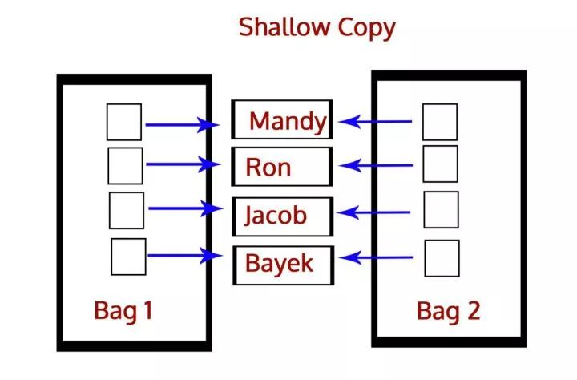

深拷贝和浅拷贝之间的区别是什么？
答：深拷贝就是将一个对象拷贝到另一个对象中，这意味着如果你对一个对象的拷贝做出改变时，不会影响原对象。在Python中，我们使用函数deepcopy()执行深拷贝，导入模块copy，如下所示：

```py
>>> import copy
>>> b=copy.deepcopy(a)
```

而浅拷贝则是将一个对象的引用拷贝到另一个对象上，所以如果我们在拷贝中改动，会影响到原对象。我们使用函数function()执行浅拷贝，使用如下所示：

```py
>>> b=copy.copy(a)
```





