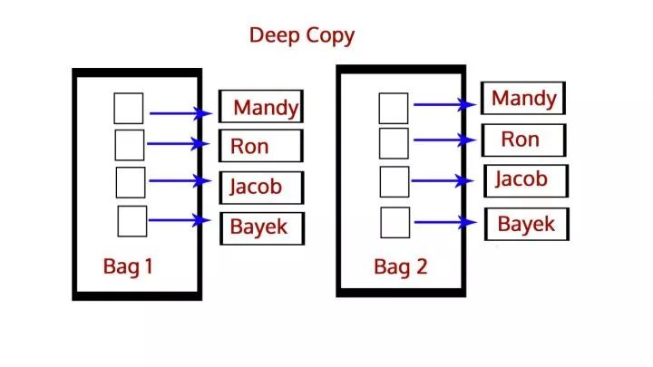
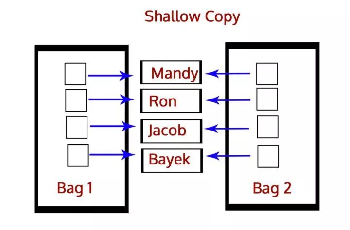

深拷贝和浅拷贝之间的区别是什么？
答：深拷贝就是将一个对象拷贝到另一个对象中，这意味着如果你对一个对象的拷贝做出改变时，不会影响原对象。在Python中，我们使用函数deepcopy()执行深拷贝，导入模块copy，如下所示：

```py
>>> import copy
>>> b=copy.deepcopy(a)
```

而浅拷贝则是将一个对象的引用拷贝到另一个对象上，所以如果我们在拷贝中改动，会影响到原对象。我们使用函数function()执行浅拷贝，使用如下所示：

```py
>>> b=copy.copy(a)
```





1、复制不可变数据类型，不管copy还是deepcopy,都是同一个地址当浅复制的值是不可变对象（数值，字符串，元组）时和=“赋值”的情况一样，对象的id值与浅复制原来的值相同。
2、复制的值是可变对象（列表和字典）
浅拷贝copy有两种情况：
第一种情况：复制的 对象中无 复杂 子对象，原来值的改变并不会影响浅复制的值，同时浅复制的值改变也并不会影响原来的值。原来值的id值与浅复制原来的值不同。
第二种情况：复制的对象中有 复杂 子对象 （例如列表中的一个子元素是一个列表）， 改变原来的值 中的复杂子对象的值 ，会影响浅复制的值。
深拷贝deepcopy：完全复制独立，包括内层列表和字典


