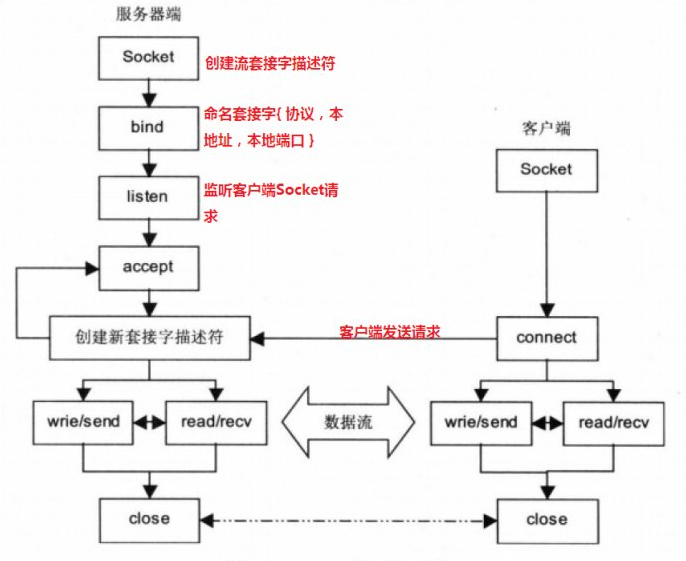
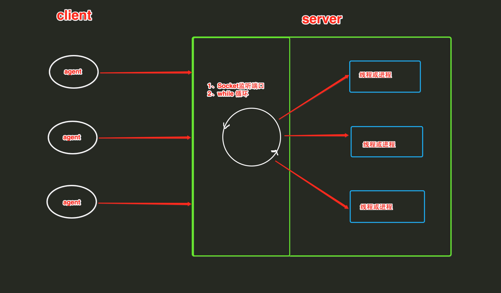
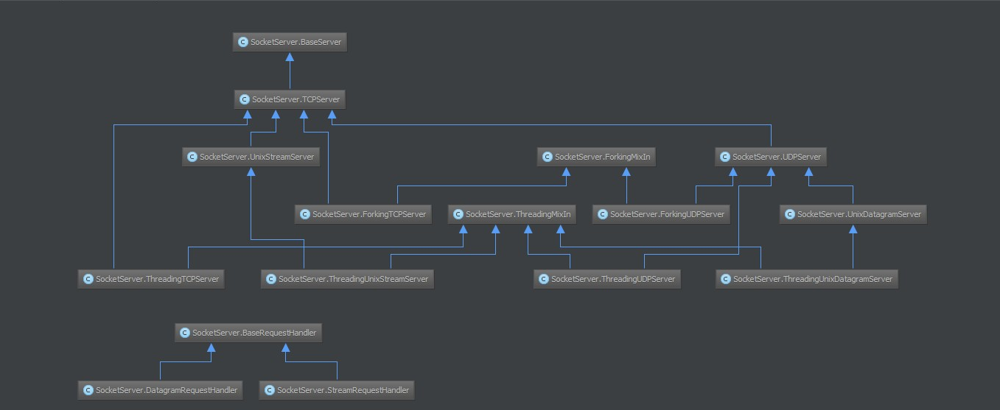

# [python之socket编程](https://www.cnblogs.com/aylin/p/5572104.html)


本章内容
1. socket
1. IO多路复用
1. socketserver


--------------------------------------------------------------------------------------

## Socket
socket起源于Unix，而Unix/Linux基本哲学之一就是“一切皆文件”，对于文件用【打开】【读写】【关闭】模式来操作。socket就是该模式的一个实现，socket即是一种特殊的文件，一些socket函数就是对其进行的操作（读/写IO、打开、关闭）

基本上，Socket 是任何一种计算机网络通讯中最基础的内容。例如当你在浏览器地址栏中输入 http://www.cnblogs.com/ 时，你会打开一个套接字，然后连接到 http://www.cnblogs.com/ 并读取响应的页面然后然后显示出来。而其他一些聊天客户端如 gtalk 和 skype 也是类似。任何网络通讯都是通过 Socket 来完成的。

Python 官方关于 Socket 的函数请看 http://docs.python.org/library/socket.html

**socket和file的区别：**
1. file模块是针对某个指定文件进行【打开】【读写】【关闭】
2. socket模块是针对 服务器端 和 客户端Socket 进行【打开】【读写】【关闭】




#### 那我们就先来创建一个socket服务端吧
server
```py
import socket

sk = socket.socket()
sk.bind(("127.0.0.1",8080))
sk.listen(5)

conn,address = sk.accept()
conn.sendall(bytes("Hello world",encoding="utf-8"))
```

client
```py
import socket

obj = socket.socket()
obj.connect(("127.0.0.1",8080))

ret = str(obj.recv(1024),encoding="utf-8")
print(ret)
```


### socket更多功能

#### sk.bind(address)
s.bind(address) 将套接字绑定到地址。address地址的格式取决于地址族。在AF_INET下，以元组（host,port）的形式表示地址。

#### sk.listen(backlog)
* 开始监听传入连接。backlog指定在拒绝连接之前，可以挂起的最大连接数量。
* backlog等于5，表示内核已经接到了连接请求，但服务器还没有调用accept进行处理的连接个数最大为5
* 这个值不能无限大，因为要在内核中维护连接队列

#### sk.setblocking(bool)
是否阻塞（默认True），如果设置False，那么accept和recv时一旦无数据，则报错。

#### sk.accept()
接受连接并返回（conn,address）,其中conn是新的套接字对象，可以用来接收和发送数据。address是连接客户端的地址。

接收TCP 客户的连接（阻塞式）等待连接的到来

#### sk.connect(address)
连接到address处的套接字。一般，address的格式为元组（hostname,port）,如果连接出错，返回socket.error错误。

#### sk.connect_ex(address)
同上，只不过会有返回值，连接成功时返回 0 ，连接失败时候返回编码，例如：10061

#### sk.close()
关闭套接字

#### sk.recv(bufsize[,flag])
接受套接字的数据。数据以字符串形式返回，bufsize指定最多可以接收的数量。flag提供有关消息的其他信息，通常可以忽略。

#### sk.recvfrom(bufsize[.flag])
与recv()类似，但返回值是（data,address）。其中data是包含接收数据的字符串，address是发送数据的套接字地址。

#### sk.send(string[,flag])
将string中的数据发送到连接的套接字。返回值是要发送的字节数量，该数量可能小于string的字节大小。即：可能未将指定内容全部发送。

#### sk.sendall(string[,flag])
将string中的数据发送到连接的套接字，但在返回之前会尝试发送所有数据。成功返回None，失败则抛出异常。
内部通过递归调用send，将所有内容发送出去。

#### sk.sendto(string[,flag],address)
将数据发送到套接字，address是形式为（ipaddr，port）的元组，指定远程地址。返回值是发送的字节数。该函数主要用于UDP协议。

#### sk.settimeout(timeout)
设置套接字操作的超时期，timeout是一个浮点数，单位是秒。值为None表示没有超时期。一般，超时期应该在刚创建套接字时设置，因为它们可能用于连接的操作（如 client 连接最多等待5s ）

#### sk.getpeername()
返回连接套接字的远程地址。返回值通常是元组（ipaddr,port）。

#### sk.getsockname()
返回套接字自己的地址。通常是一个元组(ipaddr,port)

#### sk.fileno()
套接字的文件描述符


### TCP：

#### 案例一 机器人聊天

服务端

```py
import  socketserver

class Myserver(socketserver.BaseRequestHandler):

    def handle(self):

        conn = self.request
        conn.sendall(bytes("你好，我是机器人",encoding="utf-8"))
        while True:
            ret_bytes = conn.recv(1024)
            ret_str = str(ret_bytes,encoding="utf-8")
            if ret_str == "q":
                break
            conn.sendall(bytes(ret_str+"你好我好大家好",encoding="utf-8"))

if __name__ == "__main__":
    server = socketserver.ThreadingTCPServer(("127.0.0.1",8080),Myserver)
    server.serve_forever()
```

客户端
```py
import socket

obj = socket.socket()

obj.connect(("127.0.0.1",8080))

ret_bytes = obj.recv(1024)
ret_str = str(ret_bytes,encoding="utf-8")
print(ret_str)

while True:
    inp = input("你好请问您有什么问题？ \n >>>")
    if inp == "q":
        obj.sendall(bytes(inp,encoding="utf-8"))
        break
    else:
        obj.sendall(bytes(inp, encoding="utf-8"))
        ret_bytes = obj.recv(1024)
        ret_str = str(ret_bytes,encoding="utf-8")
        print(ret_str)
```


#### 案例二 上传文件

服务端
```py
import socket

sk = socket.socket()

sk.bind(("127.0.0.1",8080))
sk.listen(5)

while True:
    conn,address = sk.accept()
    conn.sendall(bytes("欢迎光临我爱我家",encoding="utf-8"))

    size = conn.recv(1024)
    size_str = str(size,encoding="utf-8")
    file_size = int(size_str)

    conn.sendall(bytes("开始传送", encoding="utf-8"))

    has_size = 0
    f = open("db_new.jpg","wb")
    while True:
        if file_size == has_size:
            break
        date = conn.recv(1024)
        f.write(date)
        has_size += len(date)

    f.close()
```

客户端
```py
import socket
import os

obj = socket.socket()

obj.connect(("127.0.0.1",8080))

ret_bytes = obj.recv(1024)
ret_str = str(ret_bytes,encoding="utf-8")
print(ret_str)

size = os.stat("yan.jpg").st_size
obj.sendall(bytes(str(size),encoding="utf-8"))

obj.recv(1024)

with open("yan.jpg","rb") as f:
    for line in f:
        obj.sendall(line)
```


### UdP
udp传输
```py
import socket
ip_port = ('127.0.0.1',9999)
sk = socket.socket(socket.AF_INET,socket.SOCK_DGRAM,0)
sk.bind(ip_port)

while True:
    data = sk.recv(1024)
    print data
```

```py
import socket
ip_port = ('127.0.0.1',9999)

sk = socket.socket(socket.AF_INET,socket.SOCK_DGRAM,0)
while True:
    inp = input('数据：').strip()
    if inp == 'exit':
        break
    sk.sendto(bytes(inp,encoding = "utf-8"),ip_port)

sk.close()
```


### WEB服务应用：
```py
#!/usr/bin/env python
#coding:utf-8
import socket
  
def handle_request(client):
    buf = client.recv(1024)
    client.send("HTTP/1.1 200 OK\r\n\r\n")
    client.send("Hello, World")
  
def main():
    sock = socket.socket(socket.AF_INET, socket.SOCK_STREAM)
    sock.bind(('localhost',8080))
    sock.listen(5)
  
    while True:
        connection, address = sock.accept()
        handle_request(connection)
        connection.close()
  
if __name__ == '__main__':
  main()
```


--------------------------------------------------------------------------------------
## IO多路复用 

I/O（input/output），即输入/输出端口。每个设备都会有一个专用的I/O地址，用来处理自己的输入输出信息首先什么是I/O：

I/O分为磁盘io和网络io，这里说的是网络io


### IO多路复用:

I/O多路复用指：通过一种机制，可以监视多个描述符(socket)，一旦某个描述符就绪（一般是读就绪或者写就绪），能够通知程序进行相应的读写操作。

Linux

Linux中的 select，poll，epoll 都是IO多路复用的机制。

Linux下网络I/O使用socket套接字来通信，普通I/O模型只能监听一个socket，而I/O多路复用可同时监听多个socket.

I/O多路复用避免阻塞在io上，原本为多进程或多线程来接收多个连接的消息变为单进程或单线程保存多个socket的状态后轮询处理.

Python  

Python中有一个select模块，其中提供了：select、poll、epoll三个方法，分别调用系统的 select，poll，epoll 从而实现IO多路复用。


Windows Python：
 
    提供： select
 
Mac Python：
 
    提供： select
 
Linux Python：
 
    提供： select、poll、epoll


### 对于select模块操作的方法：

句柄列表11, 句柄列表22, 句柄列表33 = select.select(句柄序列1, 句柄序列2, 句柄序列3, 超时时间)
  
参数： 可接受四个参数（前三个必须）
返回值：三个列表
  
select方法用来监视文件句柄，如果句柄发生变化，则获取该句柄。
1. 当 参数1 序列中的句柄发生可读时（accetp和read），则获取发生变化的句柄并添加到 返回值1 序列中
2. 当 参数2 序列中含有句柄时，则将该序列中所有的句柄添加到 返回值2 序列中
3. 当 参数3 序列中的句柄发生错误时，则将该发生错误的句柄添加到 返回值3 序列中
4. 当 超时时间 未设置，则select会一直阻塞，直到监听的句柄发生变化
5. 当 超时时间 ＝ 1时，那么如果监听的句柄均无任何变化，则select会阻塞 1 秒，之后返回三个空列表，如果监听的句柄有变化，则直接执行。


#### 利用select监听终端操作实例
```py
import socket
import select


sk1 = socket.socket()
sk1.bind(("127.0.0.1",8001))
sk1.listen()

sk2 = socket.socket()
sk2.bind(("127.0.0.1",8002))
sk2.listen()

sk3 = socket.socket()
sk3.bind(("127.0.0.1",8003))
sk3.listen()

li = [sk1,sk2,sk3]

while True:
    r_list,w_list,e_list = select.select(li,[],[],1) # r_list可变化的
    for line in r_list: 
        conn,address = line.accept()
        conn.sendall(bytes("Hello World !",encoding="utf-8"))
```


#### 利用select实现伪同时处理多个Socket客户端请求
服务端：
```py
sk1 = socket.socket()
sk1.bind(("127.0.0.1",8001))
sk1.listen()

inpu = [sk1,]

while True:
    r_list,w_list,e_list = select.select(inpu,[],[],1)
    for sk in r_list:
        if sk == sk1:
            conn,address = sk.accept()
            inpu.append(conn)
        else:
            try:
                ret = str(sk.recv(1024),encoding="utf-8")
                sk.sendall(bytes(ret+"hao",encoding="utf-8"))
            except Exception as ex:
                inpu.remove(sk)
```

客户端
```py
import socket

obj = socket.socket()

obj.connect(('127.0.0.1',8001))

while True:
    inp = input("Please(q\退出):\n>>>")
    obj.sendall(bytes(inp,encoding="utf-8"))
    if inp == "q":
        break
    ret = str(obj.recv(1024),encoding="utf-8")
    print(ret)
```


#### 利用select实现伪同时处理多个Socket客户端请求读写分离

服务端：
```py
import socket
sk1 = socket.socket()
sk1.bind(("127.0.0.1",8001))
sk1.listen()
inputs = [sk1]
import select
message_dic = {}
outputs = []
while True:

    r_list, w_list, e_list = select.select(inputs,[],inputs,1)
    print("正在监听的socket对象%d" % len(inputs))
    print(r_list)
    for sk1_or_conn in r_list:
        if sk1_or_conn == sk1:
            conn,address = sk1_or_conn.accept()
            inputs.append(conn)
            message_dic[conn] = []
        else:
            try:
                data_bytes = sk1_or_conn.recv(1024)
                data_str = str(data_bytes,encoding="utf-8")
                sk1_or_conn.sendall(bytes(data_str+"好",encoding="utf-8"))
            except Exception as ex:
                inputs.remove(sk1_or_conn)
            else:
                data_str = str(data_bytes,encoding="utf-8")
                message_dic[sk1_or_conn].append(data_str)
                outputs.append(sk1_or_conn)
        for conn in w_list:
            recv_str = message_dic[conn][0]
            del message_dic[conn][0]
            conn.sendall(bytes(recv_str+"好",encoding="utf-8"))
        for sk in e_list:
            inputs.remove(sk)
```

客户端：
```py
import socket

obj = socket.socket()

obj.connect(('127.0.0.1',8001))

while True:
    inp = input("Please(q\退出):\n>>>")
    obj.sendall(bytes(inp,encoding="utf-8"))
    if inp == "q":
        break
    ret = str(obj.recv(1024),encoding="utf-8")
    print(ret)
```


## socketserver



SocketServer内部使用 IO多路复用 以及 “多线程” 和 “多进程” ，从而实现并发处理多个客户端请求的Socket服务端。即：每个客户端请求连接到服务器时，Socket服务端都会在服务器是创建一个“线程”或者“进程” 专门负责处理当前客户端的所有请求。

ThreadingTCPServer

ThreadingTCPServer实现的Soket服务器内部会为每个client创建一个 “线程”，该线程用来和客户端进行交互。

### ThreadingTCPServer基础

使用ThreadingTCPServer:

创建一个继承自 SocketServer.BaseRequestHandler 的类
类中必须定义一个名称为 handle 的方法
启动ThreadingTCPServer

服务端
```py
import  socketserver

class Myserver(socketserver.BaseRequestHandler):

    def handle(self):

        conn = self.request
        conn.sendall(bytes("你好，我是机器人",encoding="utf-8"))
        while True:
            ret_bytes = conn.recv(1024)
            ret_str = str(ret_bytes,encoding="utf-8")
            if ret_str == "q":
                break
            conn.sendall(bytes(ret_str+"你好我好大家好",encoding="utf-8"))

if __name__ == "__main__":
    server = socketserver.ThreadingTCPServer(("127.0.0.1",8080),Myserver)
    server.serve_forever()
```

客户端
```py
import socket

obj = socket.socket()

obj.connect(("127.0.0.1",8080))

ret_bytes = obj.recv(1024)
ret_str = str(ret_bytes,encoding="utf-8")
print(ret_str)

while True:
    inp = input("你好请问您有什么问题？ \n >>>")
    if inp == "q":
        obj.sendall(bytes(inp,encoding="utf-8"))
        break
    else:
        obj.sendall(bytes(inp, encoding="utf-8"))
        ret_bytes = obj.recv(1024)
        ret_str = str(ret_bytes,encoding="utf-8")
        print(ret_str)
```


### ThreadingTCPServer源码剖析

ThreadingTCPServer的类图关系如下：



内部调用流程为：

* 启动服务端程序
* 执行 TCPServer.__init__ 方法，创建服务端Socket对象并绑定 IP 和 端口
* 执行 BaseServer.__init__ 方法，将自定义的继承自SocketServer.BaseRequestHandler 的类 MyRequestHandle赋值给 self.RequestHandlerClass
* 执行 BaseServer.server_forever 方法，While 循环一直监听是否有客户端请求到达 ...
* 当客户端连接到达服务器
* 执行 ThreadingMixIn.process_request 方法，创建一个 “线程” 用来处理请求
* 执行 ThreadingMixIn.process_request_thread 方法
* 执行 BaseServer.finish_request 方法，执行 self.RequestHandlerClass()  即：执行 自定义 MyRequestHandler 的构造方法（自动调用基类BaseRequestHandler的构造方法，在该构造方法中又会调用 MyRequestHandler的handle方法）


相对应的源码如下：

#### Baseserver
```py
class BaseServer:

    """Base class for server classes.

    Methods for the caller:

    - __init__(server_address, RequestHandlerClass)
    - serve_forever(poll_interval=0.5)
    - shutdown()
    - handle_request()  # if you do not use serve_forever()
    - fileno() -> int   # for select()

    Methods that may be overridden:

    - server_bind()
    - server_activate()
    - get_request() -> request, client_address
    - handle_timeout()
    - verify_request(request, client_address)
    - server_close()
    - process_request(request, client_address)
    - shutdown_request(request)
    - close_request(request)
    - handle_error()

    Methods for derived classes:

    - finish_request(request, client_address)

    Class variables that may be overridden by derived classes or
    instances:

    - timeout
    - address_family
    - socket_type
    - allow_reuse_address

    Instance variables:

    - RequestHandlerClass
    - socket

    """

    timeout = None

    def __init__(self, server_address, RequestHandlerClass):
        """Constructor.  May be extended, do not override."""
        self.server_address = server_address
        self.RequestHandlerClass = RequestHandlerClass
        self.__is_shut_down = threading.Event()
        self.__shutdown_request = False

    def server_activate(self):
        """Called by constructor to activate the server.

        May be overridden.

        """
        pass

    def serve_forever(self, poll_interval=0.5):
        """Handle one request at a time until shutdown.

        Polls for shutdown every poll_interval seconds. Ignores
        self.timeout. If you need to do periodic tasks, do them in
        another thread.
        """
        self.__is_shut_down.clear()
        try:
            while not self.__shutdown_request:
                # XXX: Consider using another file descriptor or
                # connecting to the socket to wake this up instead of
                # polling. Polling reduces our responsiveness to a
                # shutdown request and wastes cpu at all other times.
                r, w, e = _eintr_retry(select.select, [self], [], [],
                                       poll_interval)
                if self in r:
                    self._handle_request_noblock()
        finally:
            self.__shutdown_request = False
            self.__is_shut_down.set()

    def shutdown(self):
        """Stops the serve_forever loop.

        Blocks until the loop has finished. This must be called while
        serve_forever() is running in another thread, or it will
        deadlock.
        """
        self.__shutdown_request = True
        self.__is_shut_down.wait()

    # The distinction between handling, getting, processing and
    # finishing a request is fairly arbitrary.  Remember:
    #
    # - handle_request() is the top-level call.  It calls
    #   select, get_request(), verify_request() and process_request()
    # - get_request() is different for stream or datagram sockets
    # - process_request() is the place that may fork a new process
    #   or create a new thread to finish the request
    # - finish_request() instantiates the request handler class;
    #   this constructor will handle the request all by itself

    def handle_request(self):
        """Handle one request, possibly blocking.

        Respects self.timeout.
        """
        # Support people who used socket.settimeout() to escape
        # handle_request before self.timeout was available.
        timeout = self.socket.gettimeout()
        if timeout is None:
            timeout = self.timeout
        elif self.timeout is not None:
            timeout = min(timeout, self.timeout)
        fd_sets = _eintr_retry(select.select, [self], [], [], timeout)
        if not fd_sets[0]:
            self.handle_timeout()
            return
        self._handle_request_noblock()

    def _handle_request_noblock(self):
        """Handle one request, without blocking.

        I assume that select.select has returned that the socket is
        readable before this function was called, so there should be
        no risk of blocking in get_request().
        """
        try:
            request, client_address = self.get_request()
        except socket.error:
            return
        if self.verify_request(request, client_address):
            try:
                self.process_request(request, client_address)
            except:
                self.handle_error(request, client_address)
                self.shutdown_request(request)

    def handle_timeout(self):
        """Called if no new request arrives within self.timeout.

        Overridden by ForkingMixIn.
        """
        pass

    def verify_request(self, request, client_address):
        """Verify the request.  May be overridden.

        Return True if we should proceed with this request.

        """
        return True

    def process_request(self, request, client_address):
        """Call finish_request.

        Overridden by ForkingMixIn and ThreadingMixIn.

        """
        self.finish_request(request, client_address)
        self.shutdown_request(request)

    def server_close(self):
        """Called to clean-up the server.

        May be overridden.

        """
        pass

    def finish_request(self, request, client_address):
        """Finish one request by instantiating RequestHandlerClass."""
        self.RequestHandlerClass(request, client_address, self)

    def shutdown_request(self, request):
        """Called to shutdown and close an individual request."""
        self.close_request(request)

    def close_request(self, request):
        """Called to clean up an individual request."""
        pass

    def handle_error(self, request, client_address):
        """Handle an error gracefully.  May be overridden.

        The default is to print a traceback and continue.

        """
        print '-'*40
        print 'Exception happened during processing of request from',
        print client_address
        import traceback
        traceback.print_exc() # XXX But this goes to stderr!
        print '-'*40

# Baseserver
```


#### TCP server
```py
class TCPServer(BaseServer):

    """Base class for various socket-based server classes.

    Defaults to synchronous IP stream (i.e., TCP).

    Methods for the caller:

    - __init__(server_address, RequestHandlerClass, bind_and_activate=True)
    - serve_forever(poll_interval=0.5)
    - shutdown()
    - handle_request()  # if you don't use serve_forever()
    - fileno() -> int   # for select()

    Methods that may be overridden:

    - server_bind()
    - server_activate()
    - get_request() -> request, client_address
    - handle_timeout()
    - verify_request(request, client_address)
    - process_request(request, client_address)
    - shutdown_request(request)
    - close_request(request)
    - handle_error()

    Methods for derived classes:

    - finish_request(request, client_address)

    Class variables that may be overridden by derived classes or
    instances:

    - timeout
    - address_family
    - socket_type
    - request_queue_size (only for stream sockets)
    - allow_reuse_address

    Instance variables:

    - server_address
    - RequestHandlerClass
    - socket

    """

    address_family = socket.AF_INET

    socket_type = socket.SOCK_STREAM

    request_queue_size = 5

    allow_reuse_address = False

    def __init__(self, server_address, RequestHandlerClass, bind_and_activate=True):
        """Constructor.  May be extended, do not override."""
        BaseServer.__init__(self, server_address, RequestHandlerClass)
        self.socket = socket.socket(self.address_family,
                                    self.socket_type)
        if bind_and_activate:
            try:
                self.server_bind()
                self.server_activate()
            except:
                self.server_close()
                raise

    def server_bind(self):
        """Called by constructor to bind the socket.

        May be overridden.

        """
        if self.allow_reuse_address:
            self.socket.setsockopt(socket.SOL_SOCKET, socket.SO_REUSEADDR, 1)
        self.socket.bind(self.server_address)
        self.server_address = self.socket.getsockname()

    def server_activate(self):
        """Called by constructor to activate the server.

        May be overridden.

        """
        self.socket.listen(self.request_queue_size)

    def server_close(self):
        """Called to clean-up the server.

        May be overridden.

        """
        self.socket.close()

    def fileno(self):
        """Return socket file number.

        Interface required by select().

        """
        return self.socket.fileno()

    def get_request(self):
        """Get the request and client address from the socket.

        May be overridden.

        """
        return self.socket.accept()

    def shutdown_request(self, request):
        """Called to shutdown and close an individual request."""
        try:
            #explicitly shutdown.  socket.close() merely releases
            #the socket and waits for GC to perform the actual close.
            request.shutdown(socket.SHUT_WR)
        except socket.error:
            pass #some platforms may raise ENOTCONN here
        self.close_request(request)

    def close_request(self, request):
        """Called to clean up an individual request."""
        request.close()

# TCP server
```


#### ThreadingMixIn
```py
class ThreadingMixIn:
    """Mix-in class to handle each request in a new thread."""

    # Decides how threads will act upon termination of the
    # main process
    daemon_threads = False

    def process_request_thread(self, request, client_address):
        """Same as in BaseServer but as a thread.

        In addition, exception handling is done here.

        """
        try:
            self.finish_request(request, client_address)
            self.shutdown_request(request)
        except:
            self.handle_error(request, client_address)
            self.shutdown_request(request)

    def process_request(self, request, client_address):
        """Start a new thread to process the request."""
        t = threading.Thread(target = self.process_request_thread,
                             args = (request, client_address))
        t.daemon = self.daemon_threads
        t.start()

# ThreadingMixIn
```


#### SocketServer.BaseRequestHandler
```py

class BaseRequestHandler:

    """Base class for request handler classes.

    This class is instantiated for each request to be handled.  The
    constructor sets the instance variables request, client_address
    and server, and then calls the handle() method.  To implement a
    specific service, all you need to do is to derive a class which
    defines a handle() method.

    The handle() method can find the request as self.request, the
    client address as self.client_address, and the server (in case it
    needs access to per-server information) as self.server.  Since a
    separate instance is created for each request, the handle() method
    can define arbitrary other instance variariables.

    """

    def __init__(self, request, client_address, server):
        self.request = request
        self.client_address = client_address
        self.server = server
        self.setup()
        try:
            self.handle()
        finally:
            self.finish()

    def setup(self):
        pass

    def handle(self):
        pass

    def finish(self):
        pass

# SocketServer.BaseRequestHandler
```

SocketServer的ThreadingTCPServer之所以可以同时处理请求得益于 select 和 Threading 两个东西，其实本质上就是在服务器端为每一个客户端创建一个线程，当前线程用来处理对应客户端的请求，所以，可以支持同时n个客户端链接（长连接）。


