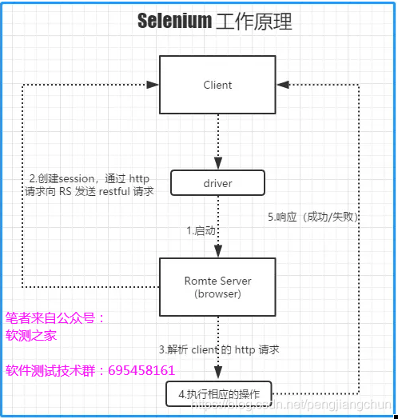

# selenium

* [Home](http://www.seleniumhq.org)
* [selenium package API cn](https://www.selenium.dev/documentation/zh-cn/)
* [selenium package API en](https://www.selenium.dev/documentation/en/)
* [Dev Github](https://github.com/SeleniumHQ/Selenium)
* [PyPI](https://pypi.org/project/selenium/)
* []()
* []()

## Selenium 原理
Selenium 是一套完整的 web 应用程序测试系统 ，它包含了测试录制(Selenium IDE)、编写及运行(Selenium Remote Control) 和测试的并行处理(Selenium Grid)。Selenium的核心 Selenium Core基于 JsUnit，完全由 JavaScript 编写，因此可以运行于任何支持 JavaScript 的浏览器上。其基本原理如下：



特点
1. 开源软件：源代码开放可以根据需求来增加工具的某些功能
2. 跨平台：linux，Windows，MAC
3. 核心功能：就是可以在多个浏览器上进行自动化测试
4. 多语言：Java，Python，C#,JavaScript，Ruby等
5. 成熟稳定：目前已经被Google，百度，腾讯等公司广泛使用
6. 功能强大：能够实现类似商业工具的大部分功能，因为开源性，可实现定制化功能


### WebDriver
1. 如果您开始使用桌面网站测试自动化, 那么您将使用 WebDriver APIs. 
2. WebDriver 使用浏览器供应商提供的浏览器自动化 API 来控制浏览器和运行测试. 这就像真正的用户正在操作浏览器一样. 
3. 由于 WebDriver 不要求使用应用程序代码编译其 API, 因此它本质上不具有侵入性. 因此, 测试的应用程序与实时推送的应用程序相同.

### Selenium IDE
1. Selenium IDE (Integrated Development Environment 集成开发环境) 是用来开发 Selenium 测试用例的工具. 
2. 这是一个易于使用的 Chrome 和 Firefox 浏览器扩展, 通常是开发测试用例最有效率的方式. 
3. 它使用现有的 Selenium 命令记录用户在浏览器中的操作, 参数由元素的上下文确定. 
4. 这不仅节省了开发时间, 而且是学习 Selenium 脚本语法的一种很好的方法.


### Grid
Selenium Grid允许您在不同平台的不同机器上运行测试用例. 可以本地控制测试用例的操作, 当测试用例被触发时, 它们由远端自动执行.

当开发完WebDriver测试之后, 您可能需要在多个浏览器和操作系统的组合上运行测试. 这就是 Grid 的用途所在.


## 安装
可以使用 pip 安装 Python 的 Selenium 库：
```py
pip install selenium
```
或者，您也可以下载 PyPI source archive (selenium-x.x.x.tar.gz) 并使用 setup.py 进行安装：
```py
python setup.py install
```


## 家族发展史
1. selenium 1.0
   1. `selenium IDE`
      1. 一个firefox插件，可以录制用户的基本操作，生成测试用例
      2. 测试用例中firefox浏览器里回访
      3. 测试用例可以转换为其他语言的自动化脚本
   2. selenium Grid
      1. 允许selenium-RC针对规模庞大的测试案例集或者需要在不同环境中运行的测试案例集进行扩展
   3. seleni RC
      1. RC是remote control 的缩写，他的功能就是模拟一个浏览器，主要测试的就是web方面
      2. 支持多平台（win，linux，mac）和多种浏览器（IE,Firefox,Opera,Safari）可以用多种语言（Java,Ruby,Python, Perl）编写测试用例
   4. 缺陷
      1. 不支持本机键盘和鼠标事件
      2. 不支持闭源策略（XSS/Https）
      3. 不支持弹出窗，对话框（基本身份认证，自签名的证书和文件上传、下载）
2. `selenium 2.0` 
   1. selenium 2.0 = selenium 1.0 + WebDriver
   2. 基于调用 WebDriver API 来模拟用户操作
   3. webDriver的速度更快，因为他直接交互使用
   4. 支持更多编程语言
3. selenium 3.0
   1. 去掉对 selenium RC 的支持
   2. 全面拥抱 java 8
   3. 支持 macOS(Sierra or later)支持官方的 safari driver
   4. 通过ms官方的 webdriver server 支持 Edge 浏览器
   5. 支持 IE9.0版本以上
   6. 通过 Mozilla 官方的 geckodriver 来支持 firefox 
4. selenium 4


## ref

* [python3和selenium3实现Web自动化(1)：搭建环境，Selenium原理，定位元素以及浏览器常规操作！](https://blog.csdn.net/weixin_48500307/article/details/108432777)
* []()
* []()
* []()
* []()
* []()
* []()
* []()

